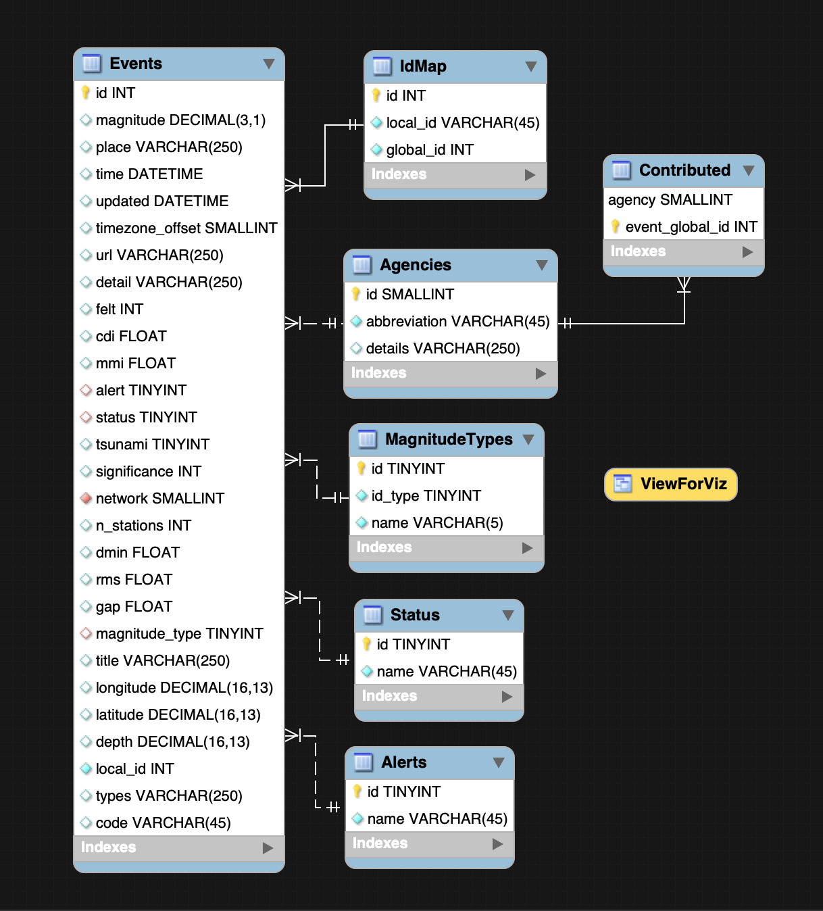
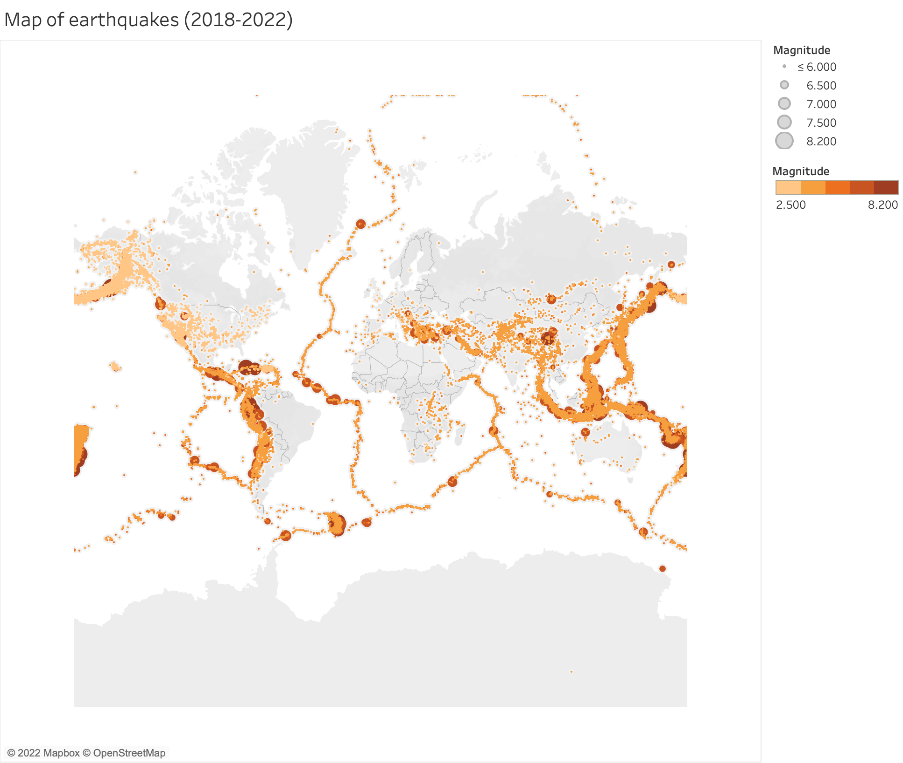
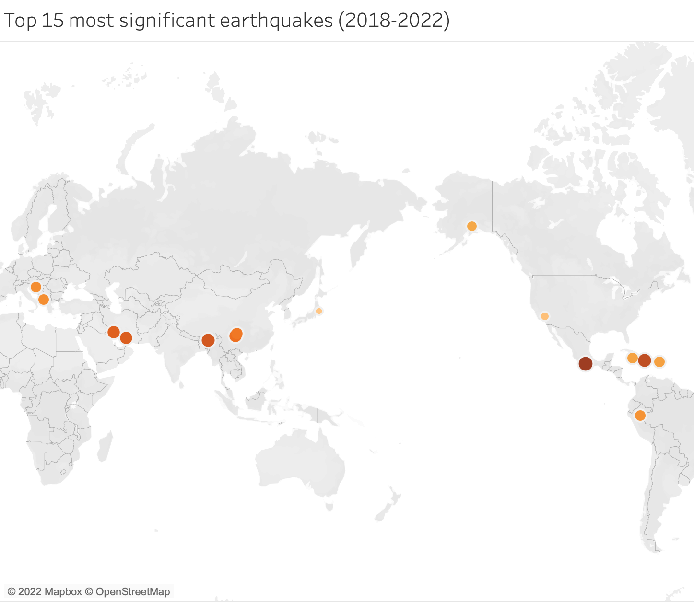

# earhquakes-geojson
Processes earthquake data stored in geojson format into (MySQL) server

## Source

[Catalog](https://earthquake.usgs.gov/) with earthquakes.

## Objective

1. Create schema for storing information about earthquakes.
2. Create a method for processing [geojson](https://earthquake.usgs.gov/earthquakes/feed/v1.0/geojson.php) into such schema.

## Warning

When we say **event** we do not mean some earthquake, but rather an observation made by a seismic station.
## Core concepts

Gejson file contains a list of _geojson entries_. An entry describes some event.

Each entry has following attributes: 
   * ***id*** (aka ***local id***) &mdash; a unique identifier for the event, _e.g._ 'us60007cc0'.
   * ***ids*** &mdash; a list of ***id***'s that are associated with the event.
   * ***magnitude type*** &mdash; the method or algorithm used to calculate the preferred magnitude for the event.
   * ***net*** (aka ***network*** aka ***agency*** aka ***contributor***) &mdash; an entity that is considered to be the prefered source of information.
   * ***sources*** &mdash; a list of all contributors.
   * ***status*** &mdash; status of observation, _e.g._ 'reviewed'.
   * ***alert*** &mdash; alert level, _e.g._ 'green'.
   * _etc_ ([see](https://earthquake.usgs.gov/data/comcat/) for the full list).
  

## Assumptions

If event does not conform to the following assumptions, an exception is thrown.

* An event has a unique ***local id***.
* Each event has a contributor.
* Each event has a **known** contributor, magnitude type, status and alert level values (or possibly null). To preserve consistency of the database, omitted/new values have to be added manually.
* It is overall consistent with other events. (See section "What it does")

## What this project does

* Creates schema/stores all necessary information about events. In particular:
* Assigns to every new event ***global id***, which uniquely identifies the earthquake, associating two events if they are (transitively) linked via **ids** list(-s). Rejects an event if a conflict arises, _e.g._ a new event refers in ***ids*** to two previously processed events, that have been assigned different ***global ids***'s.
* Keeps a table of contributors (**Contributed**) with corresponding ***global id***'s.
* Defines **MagnitudeTypes** table that contains all synonyms for different magnitude types. Two types are synonyms if and only if they have the same ***id_type***.
* For further analysis, it defines view **ViewForViz** which selects a single event (from the most trusted* ***agency***) per actual earthquake. *agency's trustworthiness is based upon how many events have it as a primary contributor.
## Model

## Scripts

[create_schema.sql](./create_schema.sql) creates MySQL schema described by model above.

[setup_database.ipynb](./setup_database.ipynb) scrapes [documentation](https://earthquake.usgs.gov/data/comcat/) to establish the list of agencies (**Agency** table). It also populates tables with common magnitude types (**MagnitudeTypes** table), status (**Status** table) and alert level (**Alerts** table) values. If event contains a variable that falls out of the predefined region, an exception is thrown.

[quakes_read_geojson.ipynb](quakes_read_geojson.ipynb) defines a procedure to read geojson files.

## Visuals

## Further improvement

* Rewrite [quakes_read_geojson.ipynb](quakes_read_geojson.ipynb) as an sql script.